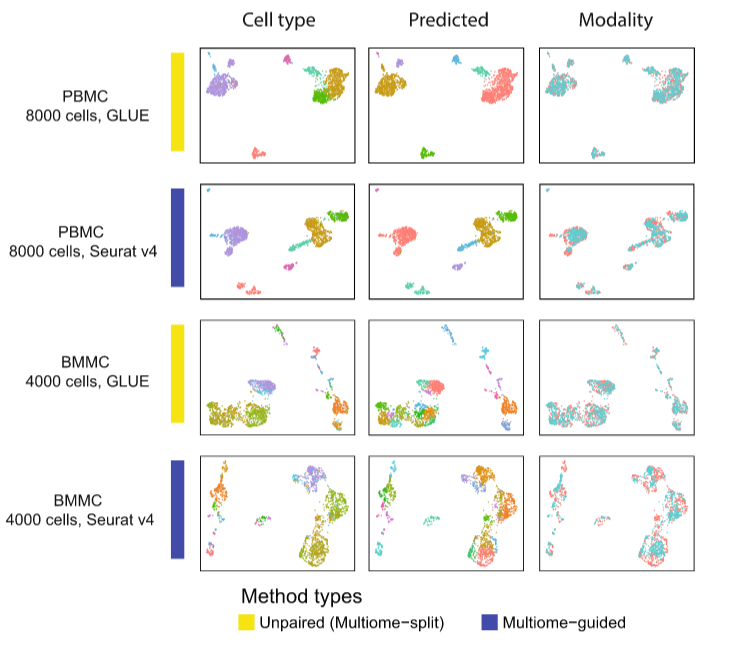

# 单细胞多组学技术实践

本文档主要分为实践与理论两个部分，在实践部分会post上部分代码，建议阅读顺序为先理论后实践！

## 理论分析

### 知识点：

`Gene activity matrix`：基因活性矩阵，是对 scATAC-seq 峰的计数进行总结，利用观察到的基因启动子和增强子处的reads，代表一个合成的 scRNA-seq 数据集，以便用于后续整合。（间接性与细胞异质性）

`Multimodal measurements`：多模态测量，可以在同一细胞中探测不同的分子特征，目前较少数据。

`Manifold`: 流形,指高维数据在低维空间中呈现的潜在几何结构。

`ARI(Adjusted Rand Index)`: 兰德指数，**衡量聚类结果与真实类别标签一致性的常用评价指标**，核心作用是量化 “聚类划分” 与 “已知真实分类” 之间的吻合程度，尤其适用于单细胞数据分析、机器学习等需要评估聚类效果的场景。


-----

由于配对数据的获得比较（）困难，与此同时我们现有大量的相似或者相近的非配对数据存在，因此对于这部分数据的利用在现在看来尤为关键！

### 配对数据分析方法

| Algorithm算法                                                | Language语言                                                 | Modality and technology模态与技术                            |
| :----------------------------------------------------------- | :----------------------------------------------------------- | :----------------------------------------------------------- |
| MOFA+ [[41](https://onlinelibrary.wiley.com/doi/10.1002/qub2.91#qub291-bib-0041)] | R                                                            | RNA expression + DNA methylation + chromatin **accessibility (scNMT-seq) RNA 表达 + DNA 甲基化 + 染色质可及性（scNMT-seq）** |
| BABEL [[42](https://onlinelibrary.wiley.com/doi/10.1002/qub2.91#qub291-bib-0042)] | Python                                                       | RNA expression + chromatin accessibility (10× Genomics; SNARE-seq; SHARE-seq); RNA expression + protein epitope (CITE-seq) **RNA 表达+染色质可及性（10× Genomics；SNARE-seq；SHARE-seq）；RNA 表达+蛋白表位（CITE-seq）** |
| Seurat v4 [[43](https://onlinelibrary.wiley.com/doi/10.1002/qub2.91#qub291-bib-0043)] | R                                                            | RNA expression + protein epitope (CITE-seq) **RNA 表达+蛋白表位（CITE-seq）** |
| scAI [[44](https://onlinelibrary.wiley.com/doi/10.1002/qub2.91#qub291-bib-0044)] | MATLAB                                                       | RNA expression + chromatin accessibility (sci-CAR); **RNA 表达+染色质可及性（sci-CAR）；** |
| R                                                            | RNA expression + DNA methylation (scM&T-seq) RNA 表达+DNA 甲基化（scM&T-seq） |                                                              |
| DCCA [[45](https://onlinelibrary.wiley.com/doi/10.1002/qub2.91#qub291-bib-0045)] | Python                                                       | RNA expression + DNA methylation (scNMT-seq); scATAC-seq + scRNA-seq (SNARE-seq; SHARE-seq; 10× Genomics) **RNA 表达 + DNA 甲基化（scNMT-seq）；scATAC-seq + scRNA-seq（SNARE-seq；SHARE-seq；10× Genomics）** |
| scDEC [[46](https://onlinelibrary.wiley.com/doi/10.1002/qub2.91#qub291-bib-0046)] | Python                                                       | RNA expression + chromatin accessibility (10× Genomics) **RNA 表达+染色质可及性（10× Genomics）** |
| Schema [[47](https://onlinelibrary.wiley.com/doi/10.1002/qub2.91#qub291-bib-0047)] | Python                                                       | RNA expression + chromatin accessibility (sci-CAR; 10× Genomics) **RNA 表达+染色质可及性（sci-CAR；10× Genomics）** |
| scMVAE [[48](https://onlinelibrary.wiley.com/doi/10.1002/qub2.91#qub291-bib-0048)] | Python                                                       | RNA expression + chromatin accessibility (SNARE-seq; scCAT-seq) **RNA 表达+染色质可及性（SNARE-seq；scCAT-seq）** |
| DAVAE [[49](https://onlinelibrary.wiley.com/doi/10.1002/qub2.91#qub291-bib-0049)] | Python                                                       | RNA expression + chromatin accessibility (10× Genomics) **RNA 表达+染色质可及性（10× Genomics）** |
| NIC [[50](https://onlinelibrary.wiley.com/doi/10.1002/qub2.91#qub291-bib-0050)] | MATLAB                                                       | RNA expression + chromatin accessibility **RNA 表达+染色质可及性** |
| scMVP [[50](https://onlinelibrary.wiley.com/doi/10.1002/qub2.91#qub291-bib-0050)] | Python                                                       | RNA expression + chromatin accessibility (sci-CAR; paired-seq; SNARE-seq; SHARE-seq) **RNA 表达+染色质可及性（sci-CAR；paired-seq；SNARE-seq；SHARE-seq）** |
| SMILE [[52](https://onlinelibrary.wiley.com/doi/10.1002/qub2.91#qub291-bib-0052)] | Python                                                       | RNA expression + chromatin accessibility (SNARE-seq; sci-CAR; SHARE-seq); DNA methylation + chromosome structure data **RNA 表达 + 染色质可及性（SNARE-seq；sci-CAR；SHARE-seq）；DNA 甲基化 + 染色体结构数据** |

### ==非配对数据分析方法==（重点）

| Alogorithm算法                                               | Language语言 | Modality and technology模态与技术                            |
| :----------------------------------------------------------- | :----------- | :----------------------------------------------------------- |
| GULER [[51](https://onlinelibrary.wiley.com/doi/10.1002/qub2.91#qub291-bib-0051)] | Python       | RNA expression + chromatin accessibility (sci-CAR; SNARE-seq; scATAC-seq) **RNA 表达+染色质可及性（sci-CAR；SNARE-seq；scATAC-seq）** |
| MATCHER [[53](https://onlinelibrary.wiley.com/doi/10.1002/qub2.91#qub291-bib-0053)] | Python       | RNA expression + chromatin accessibility; RNA expression + DNA methylation(scM&T-seq; sc-GEM); RNA expression + chromatin immunoprecipitation sequence **RNA 表达 + 染色质可及性；RNA 表达 + DNA 甲基化（scM&T-seq；sc-GEM）；RNA 表达 + 染色质免疫沉淀测序** |
| Seurat v3 [[54](https://onlinelibrary.wiley.com/doi/10.1002/qub2.91#qub291-bib-0054)] | R            | RNA expression + chromatin accessibility (scRNA-seq + scATAC-seq; SMART-seq2 + scATAC-seq; SMART-seq2 + sci-ATAC-seq1) **RNA 表达+染色质可及性（scRNA-seq+scATAC-seq；SMART-seq2+scATAC-seq；SMART-seq2+sci-ATAC-seq1）** |
| Liger [[55](https://onlinelibrary.wiley.com/doi/10.1002/qub2.91#qub291-bib-0055)] | R            | RNA expression + DNA methylation; **RNA 表达 + DNA 甲基化；** |
| CoupleNMF [[31](https://onlinelibrary.wiley.com/doi/10.1002/qub2.91#qub291-bib-0031)] | Python       | RNA expression + chromatin accessibility (SMART-seq + scATAC-seq) **RNA 表达+染色质可及性（SMART-seq+scATAC-seq）** |
| scACE [[56](https://onlinelibrary.wiley.com/doi/10.1002/qub2.91#qub291-bib-0056)] | R            | RNA expression + chromatin accessibility **RNA 表达+染色质可及性** |
| scAMACE [[57](https://onlinelibrary.wiley.com/doi/10.1002/qub2.91#qub291-bib-0057)] | R、Python    | RNA expression + chromatin accessibility **RNA 表达+染色质可及性** |
| scGCN [[58](https://onlinelibrary.wiley.com/doi/10.1002/qub2.91#qub291-bib-0058)] | Python       | RNA expression + chromatin accessibility (sci-CAR; 10× Genomics; scRNA-seq + sci-ATAC-seq) **RNA 表达+染色质可及性（sci-CAR；10× Genomics；单细胞 RNA 测序+单细胞 ATAC 测序）** |
| UnionCom [[59](https://onlinelibrary.wiley.com/doi/10.1002/qub2.91#qub291-bib-0059)] | Python       | RNA expression + DNA methylation (sc-GEM); RNA expression + DNA methylation + chromatin accessibility (scNMT-seq) **RNA 表达+DNA 甲基化（sc-GEM）；RNA 表达+DNA 甲基化+染色质可及性（scNMT-seq）** |
| CoupleCoC [[60](https://onlinelibrary.wiley.com/doi/10.1002/qub2.91#qub291-bib-0060)] | MATLAB       | RNA expression + chromatin accessibility (scATAC-seq + scRNA-seq; sci-ATAC-seq + scRNA-seq); RNA expression + DNA methylation (scRNA-seq + snmC-seq) **RNA 表达+染色质可及性（scATAC-seq + scRNA-seq；sci-ATAC-seq + scRNA-seq）；RNA 表达+DNA 甲基化（scRNA-seq + snmC-seq）** |
| MMD-MA [[61](https://onlinelibrary.wiley.com/doi/10.1002/qub2.91#qub291-bib-0061)] | Python       | RNA expression + DNA methylation (scM&T-seq) **RNA 表达+DNA 甲基化（scM&T-seq）** |
| MultiMAP [[62](https://onlinelibrary.wiley.com/doi/10.1002/qub2.91#qub291-bib-0062)] | Python       | RNA expression + chromatin accessibility **RNA 表达+染色质可及性** |
| scJoint [[63](https://onlinelibrary.wiley.com/doi/10.1002/qub2.91#qub291-bib-0063)] | Python       | RNA expression + chromatin accessibility (scRNA-seq + sci-ATAC-seq; scRNA-seq + scATAC-seq; SNARE-seq); multimodal data (CITE-seq + ASAP-seq) **RNA 表达+染色质可及性（scRNA-seq+sci-ATAC-seq；scRNA-seq+scATAC-seq；SNARE-seq）；多模态数据（CITE-seq+ASAP-seq）** |
| Pamona [[64](https://onlinelibrary.wiley.com/doi/10.1002/qub2.91#qub291-bib-0064)] | Python       | RNA expression + DNA methylation (sc-GEM); RNA expression + DNA methylation + chromatin accessibility (scNMT-seq); RNA expression + chromatin accessibility (SNARE-seq; 10× Genomics) **RNA 表达+DNA 甲基化（sc-GEM）；RNA 表达+DNA 甲基化+染色质可及性（scNMT-seq）；RNA 表达+染色质可及性（SNARE-seq；10× Genomics）** |
| uniPort [[65](https://onlinelibrary.wiley.com/doi/10.1002/qub2.91#qub291-bib-0065)] | Python       | RNA expression + chromatin accessibility (scRNA-seq + scATAC-seq) **RNA 表达+染色质可及性（单细胞 RNA 测序+单细胞 ATAC 测序）** |
| VIPCCA [[66](https://onlinelibrary.wiley.com/doi/10.1002/qub2.91#qub291-bib-0066)] | Python       | RNA expression + chromatin accessibility + DNA methylation (scNMT-seq; scRNA-seq + sci-ATAC-seq + sc-methylation data) **RNA 表达+染色质可及性+DNA 甲基化（单细胞 NMT 测序；单细胞 RNA 测序+sci-ATAC 测序+单细胞甲基化数据）** |

> from https://onlinelibrary.wiley.com/doi/10.1002/qub2.91#qub291-bib-0018



### 该领域研究进展

> 单细胞 RNA 测序（scRNA-seq）测量单个细胞中的基因表达，而单核 ATAC 测序（snATAC-seq）量化单个核中的染色质可及性。这两种数据类型提供了解码细胞类型和状态的信息。然而，当单独分析时，它们有时会在细胞类型/状态分配方面产生相互矛盾的结果。由于这两种模态反映了相同的潜在生物学，因此其能力受到损害。最近，从同一核中测量基因表达和染色质可及性已成为可能。这种成对数据使得可以直接建模两种模态之间的关系。鉴于大量单模态数据的可用性，将成对和无成对的单模态数据集整合起来，以获得对细胞复杂性的全面了解，是非常有吸引力的。
>
> [基准算法：无配对和配对单细胞 RNA 测序与 ATAC 测序数据的联合整合 | 基因组生物学 | 完整内容 --- Benchmarking algorithms for joint integration of unpaired and paired single-cell RNA-seq and ATAC-seq data | Genome Biology | Full Text](https://genomebiology.biomedcentral.com/articles/10.1186/s13059-023-03073-x)

现有的整合来自非同一批次细胞的数据的方法大致分为以下四类：

- **流型对齐**
- **矩阵分解（Liger ，coupledNMF）**
- **跨模态领近细胞相关性（Seurat）**
- **NN**

对于第一第三种方法，不适合于过大的数据集整合，第二种方法具有较好的准确度但是对于计算量的要求也非常大，第四种方法比较折中，是目前较多考虑的方法。


下图为GLUE的测试结果：




-----


## 目前思路

#### 流程

##### 1️⃣数据准备

对于单细胞转录组（scRNA-seq）数据而言，其得到的原始数据矩阵是包含了很多系统噪音与随机性噪音的，为了减少这部分噪音对生物生物信号的掩盖，我们需要对这部分数据进行整理，主要包括以下步骤

1 质量控制

> 大多数分析任务假设每个液滴都含有来自完整单个细胞的 RNA。这一假设常因细胞质量差、游离 RNA 污染或捕获多个细胞而被违反。检测到的**基因数量少**、**计数深度低**以及**线粒体计数比例高**的细胞通常被称为**低质量细胞**，因为它们可能代表膜破裂的死亡细胞。

通过手动设置阈值或基于中位数绝对偏差数量的样本特异性自动过滤来识别和过滤。这些指标被综合考虑，以防止对细胞信号的误判。**质量控制是在样本水平上进行的，因为阈值在不同样本之间可能差异很大。**

```python
#TODO
```

> **游离 RNA** 可能存在于细胞溶液中，并在文库构建过程中被分配到细胞的原生 RNA 中。环境 RNA 污染会导致细胞类型特异性标记基因转录本在其他细胞群体中也可检测到，从而将不同的细胞群体混合在一起。**空滴和双滴**（含有两个细胞的滴）违反了每个滴只含有单个细胞的假设。由不同细胞类型形成的双滴（异型双滴）难以注释，并可能导致错误的细胞类型标签。常见的双滴检测方法通过组合两个随机采样的细胞，并将它们与测量的细胞进行比较来生成人工双滴。

```python
#TODO
```

在对数据进行初步的质量控制后，我们需要进一步的对测序过程与细胞生物学差异带来的随机性进行矫正。

> 细胞由于 mRNA 含量差异（细胞大小）或测序过程中的纯随机性，可能具有不同数量的基因计数。计数标准化使细胞特征具有可比性。后续的方差稳定化确保异常值特征对整体数据结构的影响有限。
>
> **移位的对数转换**表现良好，但不应将其用于每百万计数作为输入，因为它反映了一种不切实际的过度分散。
>
> **公共因子**对所有基因进行缩放，人们假设由于细胞大小导致的计数深度差异可以忽略不计，然而对于异质性 scRNA-seq 数据集（*数据集由具有非相同细胞特性的不同细胞类型组成*），则定义每个基因的统计量可能不准确。
>
> **Scran标准化**通过合并具有相似计数深度的细胞，并使用基因的线性回归估计池大小因子，旨在最小化这个问题。
>
> **皮尔逊残差**的解析近似，该方法将测序深度作为协变量拟合广义线性模型以获得转换计数矩阵。==归一化方法应根据后续分析任务仔细选择。移位对数被证明在后续降维中更有效地稳定方差，Scran 在批次校正任务中表现良好，解析皮尔逊残差更适合生物变量基因的选择和稀有细胞身份的识别。==

因此我们需要对数据进行标准化操作，使得所有的细胞数据间能够进行比较。

```python
#TODO
```

如果数据来源于多个不同的技术重复，那我们应该在分析前（对同一实验处理组内）进行去除批次效应，确保其不会影响我们观察到的生物学现象。

> **主成分分析(PCA)**和 Harmony等线性嵌入模型在具有明显批次结构的简单整合任务中表现出色，适用于批次校正。**scANVI**可以整合细胞类型标签，这有利于保留生物学变异。根据整合任务的复杂性，例如图谱整合，深度学习方法如 **scANVI、scVI**和 **scGen**以及线性嵌入模型如 **Scanorama**表现最佳，而==对于较简单的整合任务，Harmony是首选方法。==

#### 关键

先尝试用

> A single-cell rice atlas integrates multi-species data to reveal cis-regulatory evolution

的数据来对非配对的这个多组学整合进行实验


换几个平台分析从R的`seurat`换到Python的`ScanPy`

先看几篇文献了解一下

> 1. Artificial intelligence for multimodal data integration in oncology
> 2. Artificial Intelligence in Molecular Medicine

具体流程以及代码如下：

#### 数据载入

```python
import 
```

-----

# Reference

1.Marand, A. P., Chen, Z., Gallavotti, A. & Schmitz, R. J. A cis-regulatory atlas in maize at single-cell resolution. *Cell* **184**, 3041-3055.e21 (2021).

2.Marand, A. P. *et al.* The genetic architecture of cell type–specific cis regulation in maize. *Science* https://doi.org/10.1126/science.ads6601 (2025) doi:[10.1126/science.ads6601](https://doi.org/10.1126/science.ads6601).

3.Yan, H. *et al.* A single-cell rice atlas integrates multi-species data to reveal cis-regulatory evolution. *Nat. Plants* 1–22 (2025) doi:[10.1038/s41477-025-02106-6](https://doi.org/10.1038/s41477-025-02106-6).

4.Kan, Y. *et al.* A comparison of integration methods for single-cell RNA sequencing data and ATAC sequencing data. *Quantitative Biology* **13**, e91 (2025).

5.Lin, Y. *et al.* scJoint integrates atlas-scale single-cell RNA-seq and ATAC-seq data with transfer learning. *Nat Biotechnol* **40**, 703–710 (2022).

6.Ma, S. *et al.* Chromatin Potential Identified by Shared Single-Cell Profiling of RNA and Chromatin. *Cell* **183**, 1103-1116.e20 (2020).

7.Zhu, C. *et al.* An ultra high-throughput method for single-cell joint analysis of open chromatin and transcriptome. *Nat Struct Mol Biol* **26**, 1063–1070 (2019).

8.Liu, L. *et al.* Deconvolution of single-cell multi-omics layers reveals regulatory heterogeneity. *Nat Commun* **10**, 470 (2019).

9.Chen, J., Xiao, W., Zhang, E. & Chen, X. Abstract 4943: Benchmarking unpaired single-cell RNA and single-cell ATAC integration. *Cancer Res* **84**, 4943 (2024).

10.Fu, S. *et al.* Benchmarking single-cell multi-modal data integrations. *Nat Methods* 1–12 (2025) doi:[10.1038/s41592-025-02737-9](https://doi.org/10.1038/s41592-025-02737-9).

11.Lee, M. Y. Y., Kaestner, K. H. & Li, M. Benchmarking algorithms for joint integration of unpaired and paired single-cell RNA-seq and ATAC-seq data. *Genome Biology* **24**, 244 (2023).

12.Cao, Z.-J. & Gao, G. Multi-omics single-cell data integration and regulatory inference with graph-linked embedding. *Nat Biotechnol* **40**, 1458–1466 (2022).

13.Heumos, L. *et al.* Best practices for single-cell analysis across modalities. *Nat Rev Genet* **24**, 550–572 (2023).
