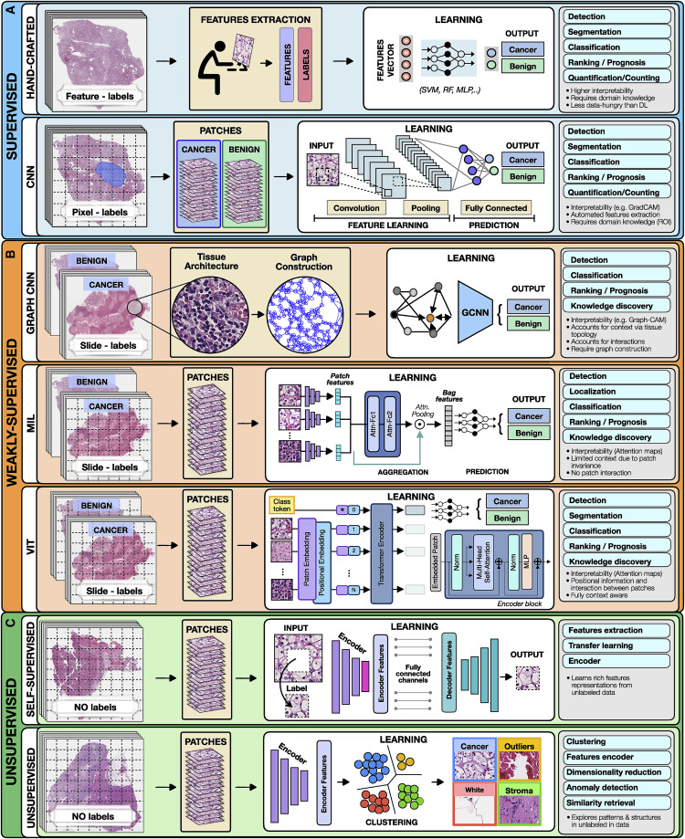

# Artificial intelligence for multimodal data integration in oncology 文献阅读

## AI在肿瘤学中的应用

作者从方法上将AI分类为监督学习`supervised`，弱监督学习`weakly supervised`和无监督学习`unsupervised`

### 对于监督学习而言

特点：使用了标注的数据点将输入的数据映射到提前定义的标签中

例子：

**人工标注**

> 人工标注的优势在于不需要进行特征的计算，能够简化模型结构，降低计算成本。且由于预测使用的特征为人为选择，因此模型具有较高的可解释性。

**表示学习方法**

> 
