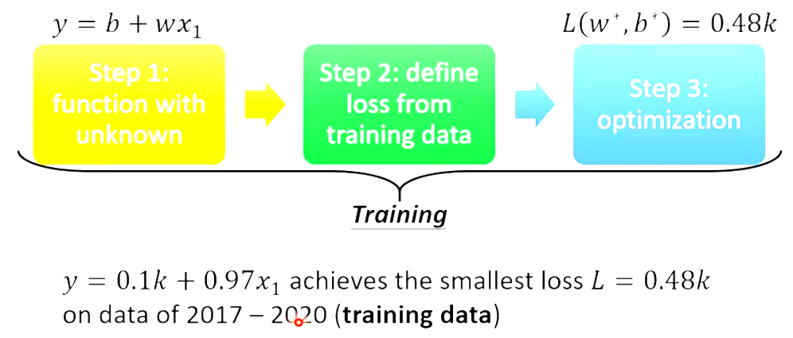
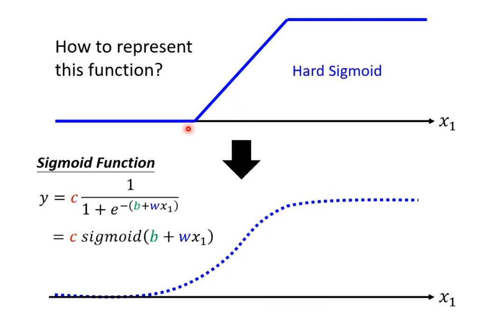
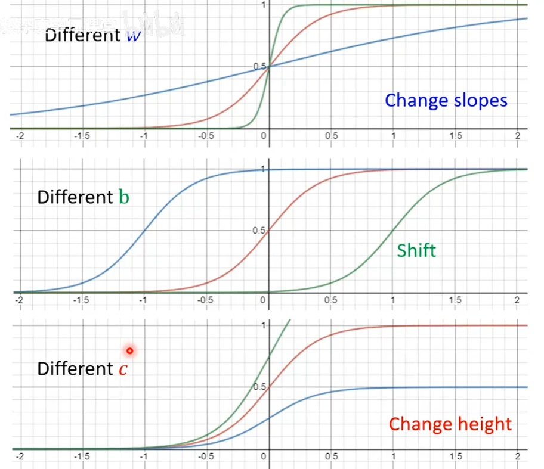

**本学习笔记是基于“李宏毅机器学习深度学习系列”视频及PDF所建立的，所以的学习资源都可以在互联网上找到**。

# 第一节：理解What‘ is ML/DL？

机器学习的本质：找一个复杂的==f(x)==能够解决复杂的问题。

## 机器学习的类别：

`Regression`(回归)，`Classification`(分类)，`Structured`(创造)。

## case1

预测视频观看人数：

### step1: Build Model

Model:
$$
y=b+wx
$$
其中 $y$ 和 $x$ 为已知的数值，而b（bias）与w（weight）是位置的

### step2: Define Loss Funcaiton

定义：
$$
L(b,w)
$$
计算：

假设
$$
L(0.5k,1)
$$
则可知
$$
0.5k+x=y
$$
带入已知的 $x$ 得到的 $y$ 与 $\widehat{y}$ 直接的差距 $e$，把所有数据的 $x$ 代入得到的 $y$ 与 $\widehat{y}$的差距 $e$ 求和，可以得到下面的公式
$$
LOSS=\frac{1}{n}\sum^{n}e_n
$$
其中当：
$$
e=|y-\widehat{y}|
$$
时 $L$ 称为mean absolute error（MAE）

> 待补充

当：
$$
e=(y-\widehat{y})^2
$$
时 $L$ 称为mean square error （MSE）

> 待补充

### step3 Optimization

使用方法：

**梯度下降 `Gradient Descent`**

解释：通过对损失函数Loss`微分`进行计算来判断某个参数的最优值。

> Hyperparameters: 超参数
>
> such as：学习率 $\eta$、最大学习次数

$$
改变值=\eta * \Delta dy(w_0的微分)
$$

==Local minima==:??

-----

ML总结流程：

## 激活函数

Sigmoid Function：

对于不同参数的sigmoid Function：

