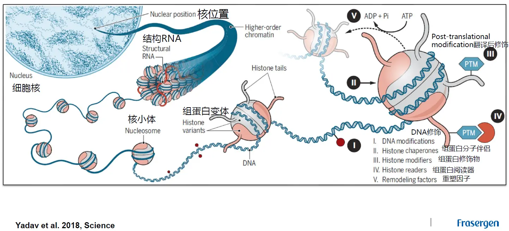
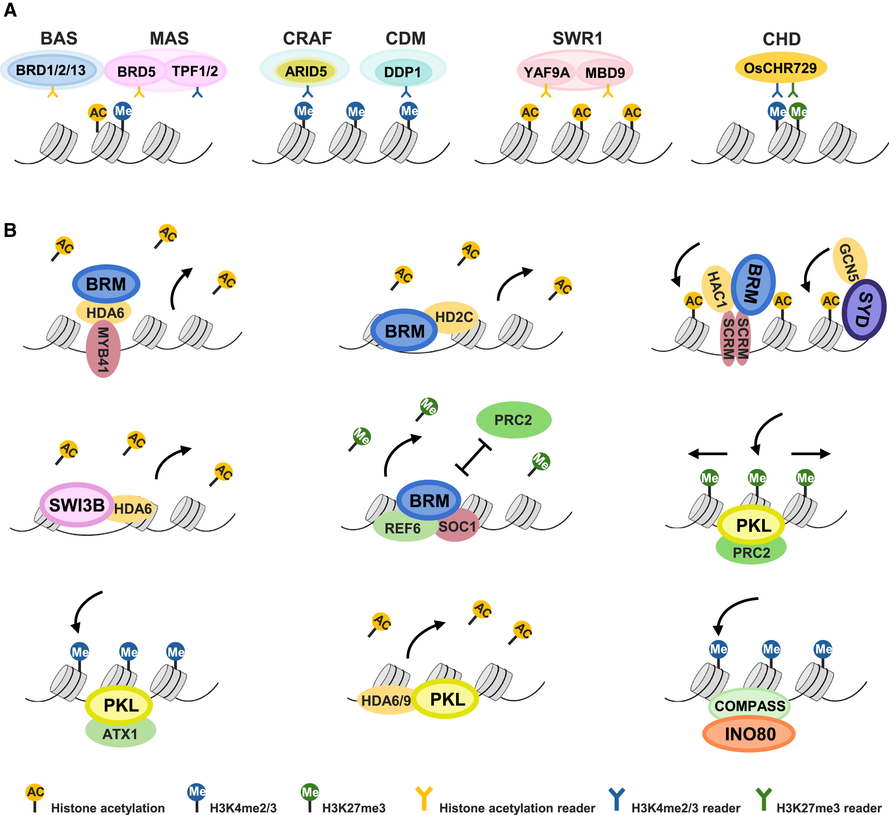

**组蛋白修饰**

| **Type of modification** |      H3K4      |      H3K9      |     H3K14      |     H3K27      |              H3K79               |     H4K20      |     H2BK5      |
| :----------------------------------- | :------------: | :------------: | :------------: | :------------: | :------------------------------: | :------------: | :------------: |
| mono-methylation单甲基化             | activation激活 |  |                | 转录促进 |          激活（DNA修复）          | activation激活 | activation激活 |
| dim-ethylation 二甲基化              | activation激活 | repression抑制 |                | repression抑制 |          转录促进          |                |                |
| tri-methylation 三甲基化             | activation激活 | repression抑制 |                | repression抑制 | ==repression抑制activation激活== | repression抑制 | repression抑制 |
| acetylation 乙酰化作用 |                | activation激活 | activation激活 |                |                                  |                |                |

转录因子调节DNA转录的机制：

- ​	直接稳定/阻止RNA聚合酶与DNA结合

- ​	催化组蛋白的乙酰化与去乙酰化（直接催化或招募相关蛋白）

​	

​	

染色质开放区并非二态性，可以对其进行量化。

染色质重组

