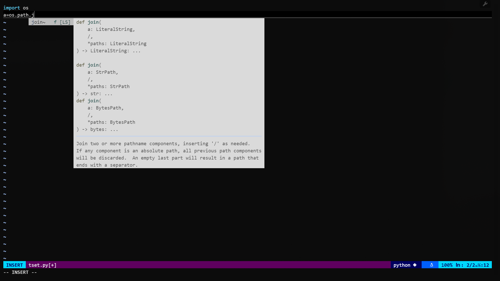

# vim美化配置以及插件的使用

不得不说，vim还是太好用啦！

先上代码：

## 基础Vim配置

```bash
set nocompatible
set backspace=indent,eol,start
set ts=4
set nocompatible
syntax on
set mouse-=a
set rtp+='$YOUPATH'+/vim/share/vim/bundle/Vundle.vim
filetype off
set hlsearch       " 搜索结果高亮
set incsearch      " 输入时即时高亮匹配
set cursorline   "高亮当前行
set showmatch    "匹配括号

```

有几个比较关键的配置，有些Vim默认设置了`set mouse-=a`和`set backspace=indent,eol,start`分别对应的功能为使用鼠标不进入==可视模式==和能够在行中进行Backspace。

我这边使用的是Vundle进行插件的管理，用Plug也可以，看个人喜好。

## 插件设置



vim好用的前提就是使用正确的插件！



主要使用了以下插件：

| Plugin             | 功能                                     |
| ------------------ | ---------------------------------------- |
| Vundle.vim         | 插件管理，伟大无需多言                   |
| nerdtree           | 文件结构浏览，还有很多功能十分实用       |
| vim-airline        | 底部标签栏美化（非必需）                 |
| vim-airline-themes | 同上                                     |
| python-syntax      | Python语法注释，比原本带的syntax要好不少 |
| vim-devicons       | 在nerdtree中显示文件的图标               |
| coc.nvim           | 实现代码补全的关键                       |
| vim-commentary     | 一键注释代码，实用！                     |
| csv.vim            | 浏览分隔符文件，一般般                   |

代码如下：

```bash
call vundle#begin('You/Path/To/vim/bundle')
Plugin 'VundleVim/Vundle.vim'
Plugin 'preservim/nerdtree'
Plugin 'vim-airline/vim-airline'
Plugin 'vim-airline/vim-airline-themes'
Plugin 'vim-python/python-syntax'
Plugin 'ryanoasis/vim-devicons'
Plugin 'neoclide/coc.nvim'
Plugin 'tpope/vim-commentary'
"Plugin 'dhruvasagar/vim-table-mode'
Plugin 'chrisbra/csv.vim'
call vundle#end()
```

不同插件的配置如下：

**nerdtree：**

```bash
"nerdtree配置
nnoremap <C-n> :NERDTree<CR>  "快捷键"
nnoremap <C-t> :NERDTreeToggle<CR>  "同上"
"让nerdtree打开每个文件前先确认其文件类型
augroup FixNERDTreeFiletype
  autocmd!
  autocmd BufEnter * if &filetype == '' | filetype detect | endif
augroup END
```

**vim-commentary：**

```bash
autocmd FileType python setlocal commentstring=#\ %s
autocmd FileType r setlocal commentstring=#\ %s
autocmd FileType sh,bash,zsh setlocal commentstring=#\ %s
autocmd FileType c,cpp,java setlocal commentstring=//\ %s
autocmd FileType tex setlocal commentstring=%\ %s
autocmd FileType yaml,yml setlocal commentstring=#\ %s
autocmd FileType markdown setlocal commentstring=<!--\ %s\ -->
```

让不同类型的文件使用不同的注释方法

**Coc.vim:**

```bash
"定义一个func 实现！切换的功能
function! ToggleCoc()
  if get(g:, 'coc_enabled', 1)
    CocDisable
  else
    CocEnable
  endif
endfunction
"cocvim配置
nnoremap <C-k> :CocDisable<CR> 
inoremap <silent><expr> <TAB>'Tab循环'
      \ pumvisible() ? "\<C-n>" :
      \ CheckBackspace() ? "\<TAB>" :
      \ coc#refresh()
inoremap <expr><S-TAB> pumvisible() ? "\<C-p>" : "\<C-h>"

function! CheckBackspace() abort
  let col = col('.') - 1
  return !col || getline('.')[col - 1]  =~# '\s'
endfunction
" Enter 确定
inoremap <expr> <CR> pumvisible() ? coc#_select_confirm() : "\<CR>"  

" 光标处显示文档
nnoremap <silent> K :call CocActionAsync('doHover
```

通过这个就可以实现类似Vscode的代码提示与补全了

效果如图：



## 实用的快捷键

对于Vim而言手不离开键盘才是最关键的😄

下面提供了一部分个人实用习惯的快捷键，可以自己修改

```bash
let mapleader=" "   
"设置热键为空格
#coc.vim补全提示开关
nnoremap <leader>k :call ToggleCoc()<CR>
#显示行号
nnoremap <leader>n :set nu!<CR>
#显示相对行号
nnoremap <leader>nn :set relativenumber!<CR>
#窗口切换
nnoremap <C-h> <C-w>h
nnoremap <C-l> <C-w>l
nnoremap <C-j> <C-w>j
nnoremap <C-k> <C-w>k
#快速保存
nnoremap <C-s> :w<CR>
nnoremap <C-q> :q<CR>
#ctrl+/快速注释
xmap <silent> <C-_> <Plug>Commentary   
nmap <silent> <C-_> <Plug>CommentaryLine
#CSV格式
nnoremap <leader>t :TableModeEnable<CR>

```

有这些配置之后就可以愉快的使用Vim进行coding了！

最后给一个懒人版：

```bash

set nocompatible
set backspace=indent,eol,start
set ts=4
set nocompatible
syntax on
set mouse-=a
set rtp+=/mnt/public5/tangyijun/local/vim/share/vim/bundle/Vundle.vim
filetype off

call vundle#begin('/mnt/public5/tangyijun/local/vim/share/vim/bundle')
Plugin 'VundleVim/Vundle.vim'
Plugin 'preservim/nerdtree'
Plugin 'vim-airline/vim-airline'
Plugin 'vim-airline/vim-airline-themes'
Plugin 'vim-python/python-syntax'
Plugin 'ryanoasis/vim-devicons'
Plugin 'neoclide/coc.nvim'
Plugin 'tpope/vim-commentary'
"Plugin 'dhruvasagar/vim-table-mode'
Plugin 'chrisbra/csv.vim'
call vundle#end()

"nerdtree配置
nnoremap <C-n> :NERDTree<CR>
nnoremap <C-t> :NERDTreeToggle<CR>
set hlsearch       " 搜索结果高亮
set incsearch      " 输入时即时高亮匹配
set cursorline   "高亮当前行
set showmatch    "匹配括号

augroup FixNERDTreeFiletype
  autocmd!
  autocmd BufEnter * if &filetype == '' | filetype detect | endif
augroup END
autocmd FileType python setlocal commentstring=#\ %s
autocmd FileType r setlocal commentstring=#\ %s
autocmd FileType sh,bash,zsh setlocal commentstring=#\ %s
autocmd FileType c,cpp,java setlocal commentstring=//\ %s
autocmd FileType tex setlocal commentstring=%\ %s
autocmd FileType yaml,yml setlocal commentstring=#\ %s
autocmd FileType markdown setlocal commentstring=<!--\ %s\ -->

"快捷键映射
let mapleader=" "

function! ToggleCoc()
  if get(g:, 'coc_enabled', 1)
    CocDisable
  else
    CocEnable
  endif
endfunction

nnoremap <leader>k :call ToggleCoc()<CR>
nnoremap <leader>n :set nu!<CR>
nnoremap <leader>nn :set relativenumber!<CR>
nnoremap <C-h> <C-w>h
nnoremap <C-l> <C-w>l
nnoremap <C-j> <C-w>j
nnoremap <C-k> <C-w>k
nnoremap <C-s> :w<CR>
nnoremap <C-q> :q<CR>
xmap <silent> <C-_> <Plug>Commentary   
nmap <silent> <C-_> <Plug>CommentaryLine
nnoremap <leader>t :TableModeEnable<CR>
"cocvim配置
nnoremap <C-k> :CocDisable<CR> 
inoremap <silent><expr> <TAB>
      \ pumvisible() ? "\<C-n>" :
      \ CheckBackspace() ? "\<TAB>" :
      \ coc#refresh()
inoremap <expr><S-TAB> pumvisible() ? "\<C-p>" : "\<C-h>"

function! CheckBackspace() abort
  let col = col('.') - 1
  return !col || getline('.')[col - 1]  =~# '\s'
endfunction
" enter 
inoremap <expr> <CR> pumvisible() ? coc#_select_confirm() : "\<CR>"

" 显示文档
nnoremap <silent> K :call CocActionAsync('doHover

```

再附上一个快捷键对照表


详细链接：[史上最全Vim快捷键键位图（入门到进阶） | 菜鸟教程](https://www.runoob.com/w3cnote/all-vim-cheatsheat.html)

