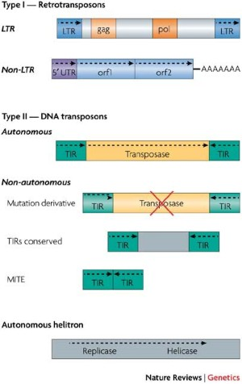

# 🔥记录一些平时的文献阅读

随便记记

## 🌟Plant ENCODE Meta analyze

当前亟待解决的问题：

低研究植物的组装基因组

未充分研究的谷物的未开发遗传多样性

蛋白组学与代谢组学的潜力

对低研究植物的功能基因研究有限

## 🌟TEs profile

### 核心定义

**Ⅰ类转座子**与**Ⅱ类转座子**：

| 类别      | 核心机制                                          | 关键步骤                                                     | 转座后原位置保留情况                                         | 特征                                                         | 分布                                                         |
| --------- | ------------------------------------------------- | ------------------------------------------------------------ | ------------------------------------------------------------ | ------------------------------------------------------------ | ------------------------------------------------------------ |
| Ⅰ类转座子 | **逆转录转座**（复制 - 粘贴模式）                 | 1. 转座子 DNA 转录生成 RNA；2. RNA 经逆转录酶催化合成 cDNA（互补 DNA）；3. cDNA 整合到基因组新位置；4. 原位置转座子 DNA 保留（因是 “复制后粘贴”）。 | **保留**（原位置仍有 1 个拷贝，新位置新增 1 个，总拷贝数增加） | 根据元件两端是否存在称为==长末端重复（LTRs）==的直接重复序列，它们可以分为两种类型。**LTR 逆转录转座子**与**非LTR逆转录转座子**（大多数）。 | **真核生物**（如人类、植物、酵母）。真核生物基因组的 “主要组成部分”，丰度远高于 Ⅱ类转座子； |
| Ⅱ类转座子 | **DNA 直接转座**（剪切 - 粘贴 / 复制 - 粘贴模式） | 1. 转座酶识别转座子两端的反向重复序列（IR）；2. **剪切 - 粘贴**：转座酶切割转座子 DNA，直接将其移至新位置，原位置 DNA 需修复（可能导致缺失）；3. **复制 - 粘贴**（部分类型）：转座子 DNA 先复制，复制本移至新位置，原位置保留（类似 1 类，但无 RNA 中间步骤）。 | **剪切 - 粘贴**：原位置丢失（需修复）；复制 - 粘贴：原位置保留 | 其核心部分只包括转座酶基因与反向重复序列（IR），其中IR作为转座酶的特异性结合位点大约300bp | 植物基因组中尤为富集（如小麦、水稻）。**原核生物**（如细菌、古菌）、**部分**真核生物。原核生物中更常见，是细菌获得抗生素抗性、毒力基因的重要途径； |

> 补充信息：
>
> - LTR 逆转录转座子（具有自主element）
>
>   （如酵母的 Ty 元件、人类的内源性逆转录病毒 ERV）：
>
>   - 两端有**长末端重复序列（LTR）** ：含启动子、终止子及整合酶识别位点，调控转座子的转录和整合；
>   - 内部编码区：含`gag`（衣壳蛋白）、`pol`（逆转录酶、整合酶、蛋白酶）基因，部分含`env`（包膜蛋白）基因（类似逆转录病毒）。
>
> - 非 LTR 逆转录转座子（部分自主）
>
>   （如人类的 LINE、SINE）：
>
>   - 无 LTR，两端常为**poly (A) 尾**或靶位点重复序列（TSR）；
>   - 典型代表：
>     - **LINE（长散在核元件）** ：如人类 LINE-1（L1），含逆转录酶和内切酶基因，可自主转座；
>     - **SINE（短散在核元件）** ：如人类 Alu 元件，无逆转录酶基因，需依赖 LINE 的酶系统完成转座（非自主型）。

目前，对于TEs的识别与注释依旧是一个受到关注的问题

### 🔮拟定研究思路



1. 拟定一个研究对象（最好是bulk数据与单细胞数据都有的）
2. 对数据中的TEs进行统一的鉴定（考虑是否创新方法？）
3. 结合表观遗传学的内容将TEs与表观遗传调控等研究结合起来，看看有没有什么有意思的东西。
4. 继续提升维度，在单细胞水平看看不同类型的细胞中的TEs（表达或类型等）是否具有特异性？能否找到这个特异性原因？
5. 聚焦到一个特定的TEs上看看能否进行试验的验证？
6. 可以考虑将所有的数据整合为一个数据库



-----

## 🌟待定

参考文献：

1. https://www.nature.com/articles/s41588-025-02245-8
